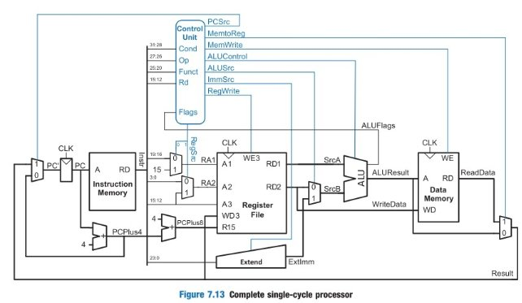
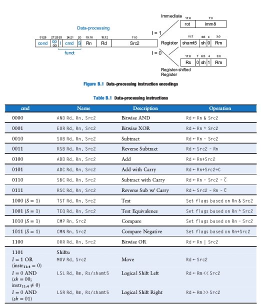

# Arquitetura de Computadores
**Curso de Engenharia de Controle e Automação**

Prof. Rafael Emerick Z. De Oliveira <[rafael. emerick @ifes.edu.br>](mailto:rafael.emerick@ifes.edu.br)

**Prazos:**

- Entrega no Google ClassRoom: 10/07/2025
- Apresentação ao Professor: até dia 11/07/2025. (a dupla deve agendar um horário junto ao professor)
- Trabalho, no máximo, em grupos de 2 participantes.
- Envie um relatório simplificado com todas as informações do seu trabalho. (Introdução, desenvolvimento e conclusão).
# **Especificação**
Você estenderá um processador simplificado de ciclo único ARM usando o SystemVerilog. Um programa de teste deverá ser carregado na memória e confirmará se o sistema funciona. Em seguida, você deve implementar novas instruções e, em seguida, escrever um adicionar estas instruções no programa de teste, para  que se confirme que as novas instruções também funcionam.  O esquema do processador de ciclo único é apresentado no final para sua conveniência. Essa versão do processador de ciclo único ARM e, neste estágio, pode executar as seguintes instruções: ADD, SUB, AND, ORR, LDR, STR e B.

# **Processador ARM Single-Cycle** 

O módulo ARM single-cycle em SystemVerilog (arm\_single.sv) pode ser encontrado no repositório: [1]

Estude o arquivo até estar familiarizado com seu conteúdo. Abra o arquivo arm\_single.sv. O módulo de nível superior (chamado top) contém o processador arm (arm) e as memórias de dados e de instruções (dmem e imem). Agora olhe para o módulo do processador (chamado arm), ele instância dois sub-módulos, “controller” e “datapath”. Agora, observe o módulo controller e seus submódulos. Ele contém dois sub- módulos: “decode” e “condlogic”. O módulo decode produz todos menos três sinais de controle. O módulo condlogic produz os três sinais de controle restantes que atualizam o estado arquitetural (RegWrite, MemWrite) ou determinam o próximo PC (PCSrc). Estes três sinais dependem da condição da instrução (Cond3:0) e dos sinalizadores (flags) de condições armazenadas (Flags3:0) que são internos ao módulo condlogic. As flags de condição produzidas pela ALU (ALUFlags3:0) são atualizadas nos registros de flags dependentes do bit S (FlagW1:0) e se a instrução é executada (novamente, dependendo da condição Cond3:0 e do valor armazenado das flags de condição Flags3:0).

A instrução e as memórias de dados instanciadas no módulo “top” são, cada uma, uma matriz de 64- palavras × 32 bits. A memória da instrução precisa conter alguns valores iniciais representando o programa. O programa de teste é dado no arquivo “memfile.s” do repositório apresentado anteriormente. Estude o programa até entender o que ele faz. O código já em idioma de máquina para o programa pode ser encontrado com o nome de “memfile.dat” no repositório.
# **Parte 1 (1 pts) – Testando o processador ARM monociclo.**
Em um sistema complexo, se você não sabe o que esperar da resposta, é improvável que você receba a resposta certa. Comece prevendo o que deve acontecer em cada ciclo ao executar o programa.

1 - Desenhe o esquemático correspondente ao HDL em SystemVerilog do processador ARM. Ilustre a hierarquia do testbench e os módulos internos ao DUT (Device Under Test). Apresente no esquemático as estruturas de conexão de forma simplificada (para fios em paralelo, trace apenas 1 fio e ilustre o número de fios que compõe tal barramento simples). 

2 - Preencha o gráfico na Tabela 1 no final com suas previsões da execução do código memfile.s do repositório fornecido. Que endereço escreverá a instrução final do STR e qual valor ela escreverá? Simule seu processador com o ModelSim. Adicione todos os sinais da Tabela 1 à sua janela de ondas. Execute a simulação. Se tudo correr bem, o testbench imprimirá “Simulação bem-sucedida”. Observe as formas de onda e verifique se elas correspondem às suas previsões na Tabela 1.
# **Parte 2 (9 pts): - Modificando  o processador ARM monocíclo**
1 - Estenda as instruções em nível de microarquitetura do processador ARM monociclo, com código HDL disponível em [1], de forma a habilitá-lo a processar as instruções **MOV, CMP,** **TST, EOR, LSL, ASR,  suporte a Registrador deslocado em instruções DP (ADD, SUB, AND, ORR)  e BL**

2 - Para validar, estenda o código de testes utilizado na parte , gere o novo código memfile2.s e memfile2.dat, com os códigos correspondentes de montagem e de máquina. 

EXTRA - (8 pts, substitui a nota de uma prova) – Definir um dispositivo E/S simulado como módulo SystemVerilog no testbench com clock de 1 MHz que faça a função de timer para a CPU principal. A troca de dados entre a CPU e o Timer deve ser feita por E/S mapeada em memória, e esse endereço deve sincronizar/espelhar com o Registrador de E/S do timer. Quando o tempo informado pelo programador por LDR no referido endereço de E/S for obtido pelo timer, este deverá contar em função do seu clock interno (gerado no testbench) e alcançado a contagem, uma flag adicional deve ser acionada no plano de controle da CPU, e a disponibilização do tempo final contado deve ser armazenado em um segundo endereço de E/S.

# **Apresentação [10pts]**
Na apresentação, deverá ser entregue o relatório final com a apresentação do trabalho realizado. Além disso, será necessária a demonstração da execução do trabalho no ModelSim. 

A nota final do trabalho será 60% (parte1 + parte2) + 40% (entrevista). + Extra (O excedente poderá compensar notas na prova.

# **Pontuação Bônus (extra)**
- Trabalhos entregues com código versionado em git em repositório público: 0,75 ponto na nota do trabalho (versionado será considerado o código com no mínimo 5 commits que mostragem e registrem a evolução do trabalho em cada etapa do desenvolvimento, maiores informações em [4]). Não faça a edição online do código, isso atrapalhará o desenvolvimento. O versionamento correto é realizado com trabalho independente de cada membro da equipe.
- Caso o trabalho esteja completamente implementado e realizado, a antecipação do prazo de entrega bonificará a nota da dupla em 5% na média final , por semana antecipada, no limite total de 15%.

**Observação importante:**

O atraso na entrega do trabalho penalizará a nota final automaticamente em 20%. Para cada dia de atraso, serão acrecidos 1% de redução no valor total do trabalho.
# **Referências**
[1] <https://github.com/rafaelrezo/armprocessors>

[2] <https://tableless.com.br/iniciando-no-git-parte-1/>
# **ESQUEMÁTICO DO PROCESSADOR ARM MONOCÍCLO DE REFERÊNCIA**

# **INSTRUÇÕES BÁSICAS DE PROCESSAMENTO DE DADOS** 

**ANEXO 1 – TABELA 1.**

|**Ciclo**|**Reset**|**PC**|**Instrução (Montagem / Máquina)**|**SrcA**|**SrcB**|**Branch**|**AluResult**|**Flags3:0**|**CondEx**|**WriteData**|**MemWrite**|**ReadData**|
| - | - | - | :- | - | - | - | - | - | - | - | - | - |
|1|||||||||||||
|2|||||||||||||
|3|||||||||||||
|4|||||||||||||
|5|||||||||||||
|6|||||||||||||
|7|||||||||||||
|8|||||||||||||
|9|||||||||||||
|10|||||||||||||
|11|||||||||||||
|12|||||||||||||
|13|||||||||||||
|14|||||||||||||
|15|||||||||||||
|16|||||||||||||
|17|||||||||||||
|18|||||||||||||
|19|||||||||||||

